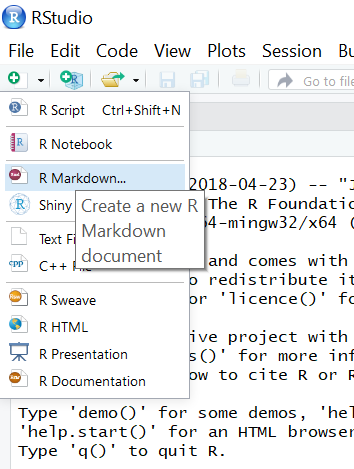
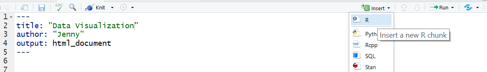
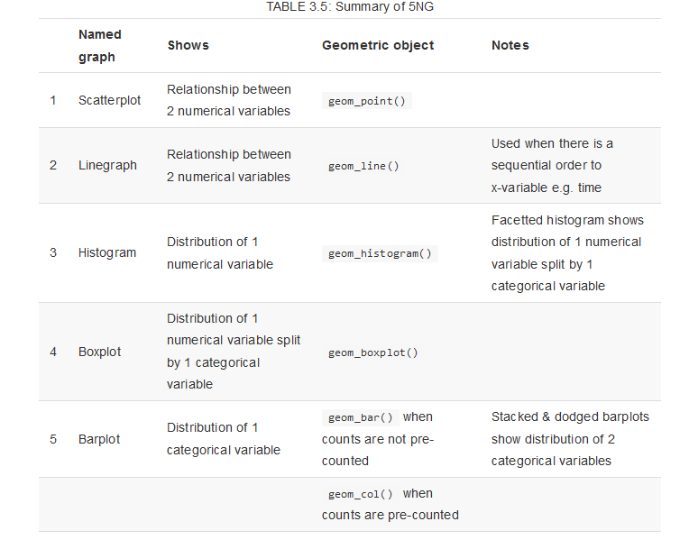

```{r, include = FALSE, message = FALSE}
library(ggplot2)
library(dplyr)
```

# Introduction 


In this problem set we will use the `ggplot2` package to generate graphics. The "The Grammar of Graphics" is the theoretical basis for the `ggplot2` package. Much like how we construct sentences in any language by using a linguistic grammar (nouns, verbs, etc.), the grammar of graphics allows us to specify the components of a statistical graphic.

In short, the grammar tells us that:

> A statistical graphic is a `mapping` of `data` variables to `aes`thetic attributes of `geom`etric objects.

We can break a graphic into the following three **essential** components:

- `data`: the data-set comprised of variables that we plot
- `geom`: this refers to our type of `geom`etric objects we see in our plot (points, lines, bars, etc.)
- `aes`: aesthetic attributes of the geometric object that we can perceive on a graphic. For example, x/y position, color, shape, and size. Each assigned aesthetic attribute can be mapped to a variable in our data-set.


# Getting Set up

Go ahead and launch RStudio, and open a new R Markdown file. Recall, to open a new R Markdown (.Rmd) file:

*  Click on the little green plus on the upper left of the window.
*  Select R Markdown, as in the image below. 


{width=200px}

<br> 

Once you have opened the document:

*  Change the title at the top to "Problem Set 1: Data Visualization". Be sure to keep the quotation marks. 
*  Add an author line with your full name, following the example below. You need quotation marks!
*  Delete any extra code (everything from line 6 down).
*  Everything between the --- is called the YAML, Yet Another Markup Language, and establishes the header and document style as a minimum. Insert a text documentation line after the YAML.

{width=100%}

<br> 

Finally, save your new R Markdown document:

-  Click File > Save As...
-  Browse to the folder where you want to store the R Markdown document and its output.
-  Name the file with the following format, `PS01_lastname_firstname_section` (fill in your last name, first name, and section). Make sure to keep the `.Rmd` file extension.

<br> 

# Deliverable 

* You will turn in your completed problem set as a **knitted pdf file** to Gradescope. 

* Include a documentation statement.  

* Each exercise is worth 3 points. 

* Be sure to **make a header to label each Exercise**, this means using # followed by the word Exercise and the exercise number. 

* Please type your code to answer the questions in a code chunk (gray part), under the exercise headers and type (**BRIEF**) answers to any interpretation questions in the white part under the headers. 

### R Packages

For this problem set we will use the following R packages:

- `dplyr`: for data wrangling
- `ggplot2`: for data visualization
- `readr`: for reading in data

Copy, paste and run the following in a code chunk (see the figure above if you forget how to insert a code chunk). 

```{r message = F}
library(dplyr)
library(ggplot2)
library(readr)
```

Remember, "running code means" telling `R` "do this". Ask yourself what do I want `R` to do and what does `R` need to do this? You can run existing code many ways:

- Re-typing code out directly in the console (most laborious method)
- Copying and pasting existing code into the console and hitting enter (easier method)
- Click on the green triangle in the code chunk (easiest method 1)
- Highlight the code and hit `Control-Enter` on PC or `Command-Return` on a Mac (easiest method 2).


### The Data

Today we will practice data visualization using data on births from the state of North Carolina. Copy, paste and run the code below in your rmarkdown file to load the data. The rmarkdown file does not use any objects in your local global environment. You must load all data and libraries into your rmarkdown file.   

```{r, message = F}
nc <- read_csv("https://docs.google.com/spreadsheets/d/e/2PACX-1vTm2WZwNBoQdZhMgot7urbtu8eG7tzAq-60ZJsQ_nupykCAcW0OXebVpHksPWyR4x8xJTVQ8KAulAFS/pub?gid=202410847&single=true&output=csv")
```

The workspace area in the upper right hand corner of the R Studio window should now list a data set called `nc` with 800 observations (rows or cases) and 13 variables (columns). Each observation or **case** is a birth of a single child. 

<br>

# How to look at data in R

As the first part of this problem set, we will explore the data. 

### Take a glimpse

You can see the **dimensions of this data frame (# of rows and columns)**, the names of the variables, the variable types, and the first few observations using the `glimpse` function. Copy, paste, and run the following in a new code chunk in your rmarkdown file.

```{r eval = F}
glimpse(nc)
```

We will see that there are 1000 observations and 13 variables in this data set. The variable names are `fage`, `mage`, `mature`, etc. This output also tells us that some variables are numbers...some specifically integers `<int>`, others are numbers with decimals  `<dbl>`.  Some of the variables are factors `<fct>`. It is a good practice to see if R is treating variables as factors `<fct>`; as numbers `<int>` or `<dbl>` (basically numbers with decimals); or as characters (i.e. text) `<chr>`. 

1. Looking at the output of the `glimpse()` function, has does `R` classify the variable `mature`? Same question for the variable `gained`. (Answer with text)

**Remember** to answer this question in your rmarkdown file. Start the section with the label `## Exercise 1` and then insert two returns before typing your answer.  

### The data viewer

You can view the data by clicking on the name `nc` in the *Environment* pane (upper right window). This will bring up an alternative display of the data set in the *Data Viewer* (upper left window). R has stored these data in a kind of spreadsheet called a *data frame*. Each row represents a  different birth: the first entry or column in each row is simply the row number, the rest are the different variables that were recorded for each birth. You can close the data viewer by clicking on the `x` in the upper left hand corner.

You can also view the data by using the `View()` in the console window. Using `View()` in an rmarkdown document will not include anything in your final knitted document. If you want to display the data in your report, use the `head()` function.

```{r}
head(nc)
```


### Knit your document 

<div id="license">
It is a good idea to try kitting your document from time to time as you go along! Go ahead, and make sure your document is knitting, and that your knitted file includes Exercise headers, text, and code. Note that knitting automatically saves your Rmd file too!
</div>

# Types of Graphs
We will explore four different types of graphs in this problem set. We discussed and explored these in class. 

- Scatterplots
- Boxplots
- Histograms 
- Barplots

##  Scatterplots
Scatterplots allow you to investigate the relationship between two **numerical** variables. As a review, let's view the scatterplot through the lens of the *Grammar of Graphics*. Specifically, we will graphically investigate the relationship between the following two numerical variables in the `nc` data frame:

- `weeks`: length of a pregnancy on the horizontal "x" axis and
- `weight`: birth weight of a baby in pounds on the vertical "y" axis


```{r fig.height=3, fig.width=4, warning=F}
ggplot(data = nc, aes(x = weeks, y = weight)) + 
  geom_point()
```


Let's view this plot through the grammar of graphics. Within the `ggplot()` function call, we specified:

- The data frame to be `nc` by setting `data = nc`
- The `aes`thetic `mapping` by setting `aes(x = weeks, y = weight)`
- The variable `weeks` maps to the `x`-position `aes`thetic
- The variable `weight` maps to the `y`-position `aes`thetic.

We also add a layer to the `ggplot()` function call using the `+` sign. The layer in question specifies the `geom`etric object here as `point`s,  by specifying `geom_point()`.


<br>

Finally, we can also add axis labels and a title to the plot so as to improve the presentation. Again we add a new layer, this time a `labs` or labels layer. We can also change the background theme by adding a new theme layer.

```{r fig.height=3, fig.width=4, warning=F}
ggplot(data = nc, aes(x = weeks, y = weight)) + 
  geom_point(alpha=.3) + 
  labs(x = "Length of pregnancy (in weeks)", y = "Birth weight of baby (lbs)", 
       title = "Relationship between pregnancy duration and newborn weight") +
  theme_classic()
```

If we are just exploring the data, we don't need to clean up the graph. However, for presentation in a report, it is needed. Notice that there is a positive relationship between these variables. 


1.  Make a graph showing a mother's age `mage` on the x axis and the variable `weeks` on the y axis.  Include axis labels with measurement units, and a title. (`R` code and output)

```{r include = F}
ggplot(data = nc, aes(x = mage, y = weeks))+ 
  geom_point()
```


1.  Study the code below, and the resulting graphical output. Note that we added a new argument of `color = premie` and `shape = marital` **inside** the `aes`thetic mapping. The variable `premie` indicates whether a birth was early (premie) or went full term and `marital` represents the marital status of the mother. Please answer with text:

     **A.** What did adding the argument `alpha = 0.3` accomplish? 
     
     **B.** How many **variables** are now displayed on this plot?  
     
     **C.** What appears to (roughly) be the pregnancy length cutoff for classifying a newborn as a "premie"" versus a "full term". 

```{r fig.height=3, fig.width=5, warning=F}
ggplot(data = nc, aes(x = weeks, y = gained, color = premie, shape = marital))+ 
  geom_point(alpha=0.3) + 
  labs(x = "Pregnancy length (wks)", y = "Maternal weight gain (lbs)") +
  theme_light()
```


1. Make a new scatterplot that shows a mothers age on the x axis (variable called `mage`) and pregnancy length on the y axis (`weeks`). Color the points on the plot based on the gender of the resulting baby (variable called `gender`). Change the shape based on the marital status of the mother (variable called `marital`). Use `alpha` value of 0.4 and use the classic theme. There should not appear to be any strong relationship between a mother's age and the pregnancy length. (`R` code and output)

```{r include = F}
ggplot(data = nc, aes(x = mage, y = weeks, color = gender, shape = marital)) + 
  geom_point(alpha = 0.4) + 
  labs(x = "Mother's age (in years)", y = "Pregnancy length (weeks)", 
       title = "Pregnancy length by age, baby gender, and marital status") +
  theme_classic()
```

<div id="license">
Make sure your document is knitting, and that your knitted file includes Exercise headers, text, and code. Note that knitting automatically saves your Rmd file too!
</div>

## Histograms 

Histograms are useful plots for showing how many elements of a **single numerical** variable fall in specified bins. This is a very useful way to get a sense of the **distribution** of your data. Histograms are often one of the first steps in exploring data visually. 


For instance, to look at the distribution of the mother's age (variable called `mage`), copy, paste and run the following in a new code chunk:

```{r fig.height=3, fig.width=5}
ggplot(data = nc, aes(x = mage))+ 
  geom_histogram()
```


A few things to note here:

- There is only one variable being mapped in `aes()`: the single numerical variable `mage`. You don't need to compute the `y`-`aes`thetic: R calculates it automatically.
- We set the geometric object as `geom_histogram()`
- The warning message encourages us to specify the number of bins on the histogram, as `R` chose 30 for us. 

We can change the binwidth (and thus the number of bins), as well as the colors like so. 

```{r fig.height=3, fig.width=5, warning = F}
ggplot(data = nc, aes(x = mage))+ 
  geom_histogram(binwidth = 1, color = "white", fill = "steelblue") +
  theme_classic()
```

Note that none of these arguments went inside the `aes`thetic `mapping` argument as they do not specifically represent mappings of variables. 

1. Inspect the histogram of the `mage` variable. Answer each of the following with **text**. 

    **A.** The y axis is labeled **count**. What is specifically being counted in this case? Hint: think about what each case is in this data set. 
    
    **B.** What appears to be roughly the average mother's age in years?
    


5.  Make a histogram of the birth `weight` of newborns (which is in lbs), including a title and axis labels. (`R` code and output for answer)

```{r include = F}
ggplot(data = nc, aes(x =  weight)) +
  geom_histogram(binwidth = 1, color = "white", fill = "sienna") + 
  labs(x = "Newborn weight (lbs)", y = "Count", title = "Distribution of newborn birth weights") +
  theme_classic()
```


### Faceting 
Faceting is used when we'd like to create small multiples of the same plot over a different categorical variable. By default, all of the small multiples will have the same vertical axis.

For example, suppose we were interested in looking at whether pregnancy length varied by the maturity  status of a mother (column name `mature`). This is what is meant by "the distribution of one variable over another variable": `weeks` is one variable and `mature` is the other variable. In order to look at histograms of `weeks` for older and more mature mothers, we add a plot layer `facet_wrap(~ mature, ncol = 1)`. The `ncol = 1` argument just tells R to stack the two histograms into one column. 

```{r fig.height=3, fig.width=4, warning = F}
ggplot(data = nc, aes(x = weeks)) +
  geom_histogram(binwidth = 1, color = "white", fill = "steelblue") +
  facet_wrap(~ mature, ncol = 1)
```


1.  Make a histogram of newborn birth `weight` split by `habit`, the smoking status of the mother. Set the binwidth to 0.5. There are many fewer mothers who smoke. Do nonsmokers appear to have babies with a slightly larger median birth weight? (Text and `R` code and output for answer)

```{r include = F}
ggplot(data = nc, aes(x = weight)) +
  geom_histogram(binwidth = 0.4, color = "white", fill = "steelblue") +
  facet_wrap(~ habit, ncol = 1)
```

<div id="license">
Make sure your document is knitting, and that your knitted file includes Exercise headers, text, and code. Note that knitting automatically saves your Rmd file too!
</div>


## Boxplots

While histograms can help to show the distribution of data, boxplots have much more flexibility, and can provide even more information in a single graph. The y `aes`thetic is the numeric variable you want to include in the boxplot, and the x `aes`thetic is a grouping variable. For instance, below we set  `gender` as the `aes`thetic `mapping` for x, and `gained` as the `aes`thetic `mapping` for y. This creates a boxplot of the weight gained for mothers that had male and female newborns.  Note that the `fill` argument is not necessary, but sets a color for the boxplots. 

```{r fig.height=3, fig.width=4, warning= FALSE}
ggplot(data = nc, aes(x = gender, y = gained)) +
  geom_boxplot(fill = "sienna")
```


<div id="license">
For review, these are the different parts of the boxplot: '

- The bottom of the "box" portion represents the 25th percentile (1st quartile)
- The horizontal line in the "box" shows the median (50th percentile, 2nd quartile)
- The top of the "box" represents the 75th percentile (3rd quartile)
- The height of each "box", i.e. the value of the 3rd quartile minus the value of the 1st quartile, is called the interquartile range (IQR). It is a measure of spread of the middle 50% of values. Longer boxes indicating more variability.
- The "whiskers" extending out from the bottoms and tops of the boxes represent points less than the 25th percentile and greater than the 75th percentiles respectively. They extend out **no more than** 1.5 x IQR units away from either end of the boxes. The length of these whiskers show how the data outside the middle 50% of values vary. Longer whiskers indicate more variability.
- The dots represent values falling outside the whiskers or outliers. The definition of an outlier is somewhat arbitrary and not absolute. In this case, they are defined by the length of the whiskers, which are no more than 1.5 x IQR units long.
</div>


1. Make a boxplot of the weight `gained` by mothers, split by the marital status of the mothers (`marital`).  Include axis labels and a title on your plot. Is the variation in weight gained during pregnancy larger for married or single mothers? (Text and `R` code and output)

```{r include = F}
ggplot(data = nc, aes(x = marital, y = gained)) + 
  geom_boxplot(fill = "steelblue") + 
  labs(x = "Marital status of mother", y = "Pregnancy weight gain (lbs)", 
       title = "Gravida weight gain for single and married mothers")
```


1. Make a boxplot of pregnancy duration in `weeks` by smoking `habit`. Are there more outliers in the duration of pregnancy for smokers or non-smokers? (Text and `R` code and output for answer)

```{r include = F}
ggplot(data = nc, aes(x = habit, y = weeks)) + 
  geom_boxplot(fill = "steelblue")
```

<div id="license">
Make sure your document is knitting, and that your knitted file includes Exercise headers, text, and code. Note that knitting automatically saves your Rmd file too!
</div>


<br>

## Barplots   

Barplots are plots for showing, counting, how many elements of a **single categorical** variable fall in the different categories. This is a useful way to get a sense of the **distribution** of the categories. Tables can also be used for this purpose. 


For instance, to look at the distribution of the premature babies (variable called `premie`), copy, paste and run the following in a new code chunk:

```{r fig.height=3, fig.width=5}
ggplot(data = nc, aes(x = premie))+ 
  geom_bar()
```


A few things to note here:

- There is only one variable being mapped in `aes()`: the single categorical variable `premie`. You don't need to compute the `y`-`aes`thetic: `R` calculates it automatically.
- We set the geometric object as `geom_bar()` because the data has not been pre-counted. If it were pre-counted, we would use `geom_col()`. 


We can change the labels as well as the colors. 

```{r fig.height=3, fig.width=5, warning = F}
ggplot(data = nc, aes(x = premie))+ 
  geom_bar(color = "white", fill = "steelblue") +
  labs(x="Premature Status",title="Premature Babies") +
  theme_classic()
```

To make this into proportions, is more difficult. Here is the code, but you are not going to be held accountable for this code as it uses advanced features of `ggplot()`.  

```{r fig.height=3, fig.width=5, warning = F}
ggplot(data = nc, aes(x = premie,y=..prop..,group=1))+ 
  geom_bar(color = "white", fill = "slategray") +
  labs(x="Premature Status", y= "Proportion", title="Premature Babies") +
  theme_classic()
```

To make a table we could use `dplyr` functions.

```{r}
nc %>%
  count(premie) %>%
  mutate(perc=n/sum(n)*100)
```

We can add a second variable to create a barplot of two variables using the `fill` argument.  

1. Make a side-by-side barplot of marital status `marital` and gender of the baby `gender`. Are female babies more common in both married and single mothers? (Text and `R` code and output for answer)

```{r include = F}
ggplot(data = nc, aes(x = marital, fill = gender)) + 
  geom_bar(position = "dodge")
```

<div id="license">
Make sure your document is knitting, and that your knitted file includes Exercise headers, text, and code. Note that knitting automatically saves your Rmd file too!
</div>


<br>


------

<br>

### Data visualization table
This table is a great resource for thinking about how to visualize data. 



Table 3.5 from Modern Dive 
http://moderndive.netlify.com/index.html

<br>


------

<br>

# Turning in your work

For each problem set you will submit a **PDF** file with all your code and text on Gradescope. The steps to do this are as follows: 

- Knit a final copy with all your changes and work, **making sure to choose "Knit to PDF" from the drop-down menu**.
- Look at your final PDF file to make sure it contains the work you expect, and is formatted properly (e.g. 10 Exercise headers, each with answers for this week)
- Download and/or find the PDF file on your computer's hard drive. It should be found in the same folder as the R Markdown document where you did your work.
- Upload the file to the corresponding assignment on Gradescope. If you haven't joined the couse on Gradesceope, click the "Add Course" button on the home page after you login, and enter the enrollment code posted on the Teams page.
- In Gradescope, be sure to annotate the pages where your responses to each question are. You can find a helpful video on submitting an assignment on Gradescope [here](https://www.youtube.com/watch?v=KMPoby5g_nE).

<br>


------

<br>

# Documenting software 

  * File creation date: `r Sys.Date()`
  * `r R.version.string`
  * `dplyr` package version: `r packageVersion("dplyr")`
  * `ggplot2` package version: `r packageVersion("ggplot2")`
  * `readr` package version: `r packageVersion("readr")`


* * *